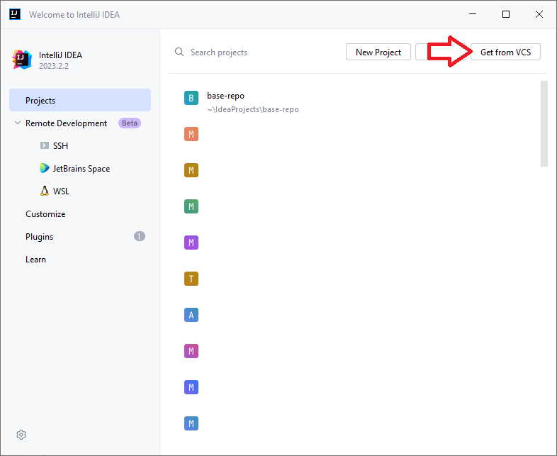
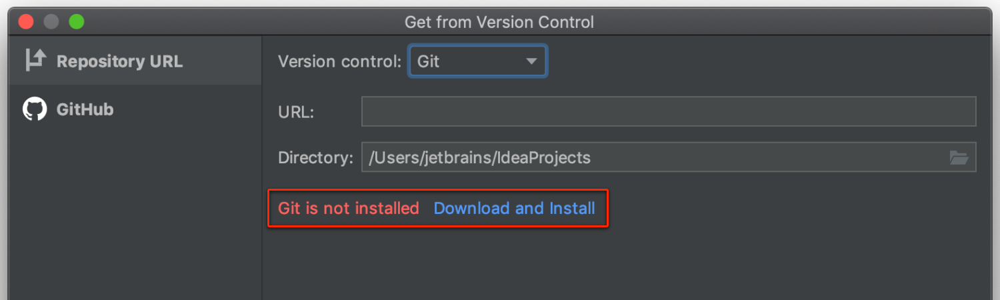

# Vorkurs Software-Entwicklung
Universität Passau / msg systems ag - Wintersemester 2022/23

# Installation der Entwicklungsumgebung

Für die Teilnahme am Kurs ist eine funktionierende Entwicklungsumgebung auf dem eigenen Rechner notwendig.

Für die Entwicklung benutzen wir IntelliJ IDEA in der (kostenlosen) Community Edition. Die Übungsaufgaben werden euch über git zum Download bereit gestellt.

## IntellJ IDEA Download Links
* Windows: https://download.jetbrains.com/idea/ideaIC-2023.2.2.exe
* macOS (Intel): https://download.jetbrains.com/idea/ideaIC-2023.2.2.dmg
* macOS (Apple M1/M2): https://download.jetbrains.com/idea/ideaIC-2023.2.2-aarch64.dmg
* Linux: https://download.jetbrains.com/idea/ideaIU-2023.2.2.tar.gz

## Vorkurs Repository & git
Um die Übungsaufgaben herunterzuladen, klickt im IntelliJ-Startbildschirm auf "Get from VCS".

Fügt unter "URL" nun die Adresse des Übungsrepository ein: https://github.com/msg-up-vorkurs/vorkurs-se-2023

Damit die Aufgaben heruntergeladen werden können, wird mit git ein separates Programm benötigt. git kann direkt über IntelliJ installiert werden:

Mit Klick auf "Download and install" wird git automatisch auf euren Rechner heruntergeladen und installiert.

## Probleme beim Download?
Falls bei euch Probleme beim Download auftreten (langsames WLAN, Verbindungsabbrüche, etc.), gebt Bescheid! Es liegen USB-Sticks mit allen benötigten Installationsdateien bereit. 